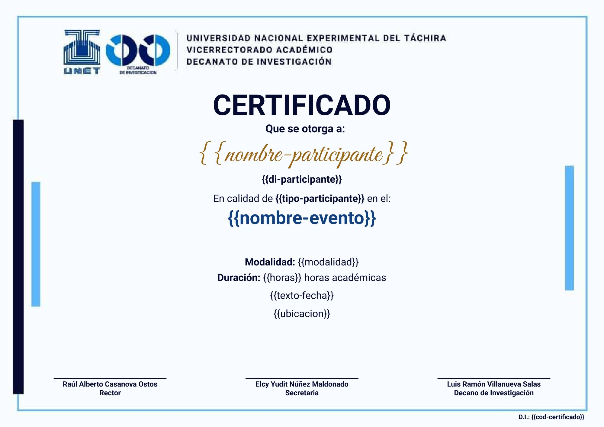
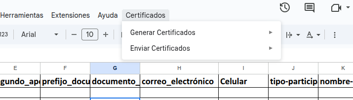
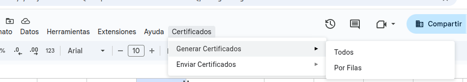
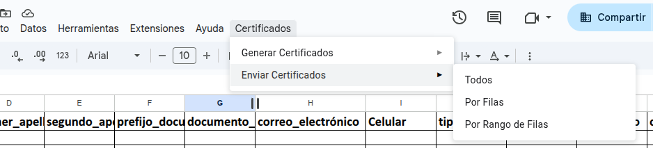
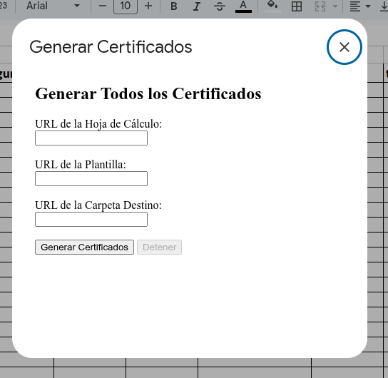
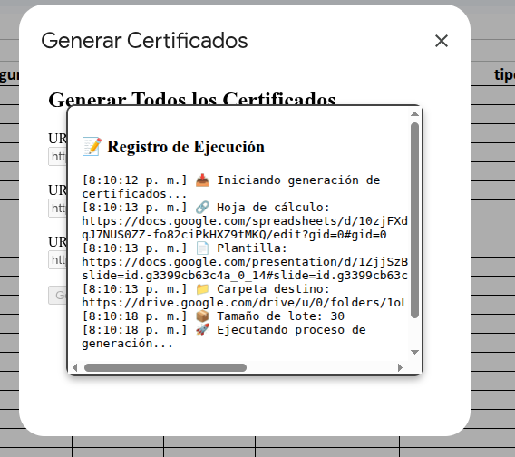
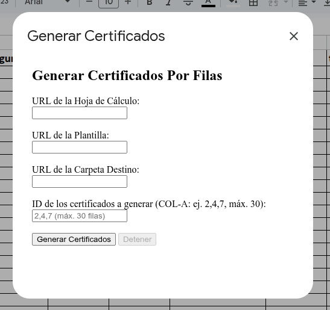
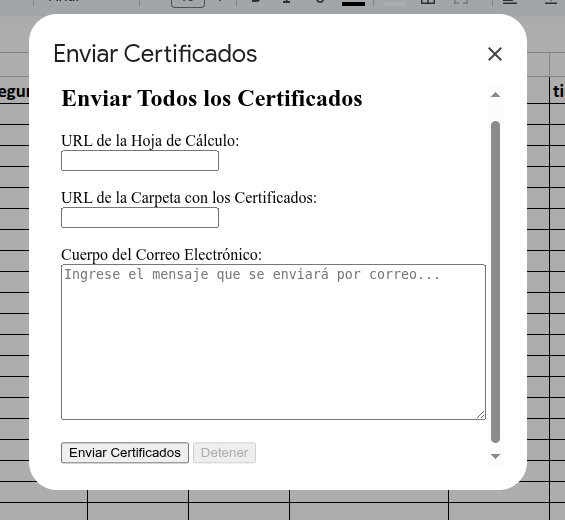
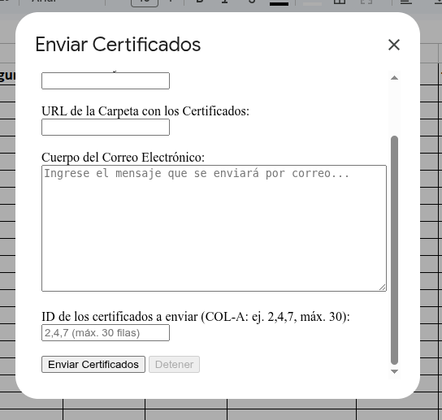
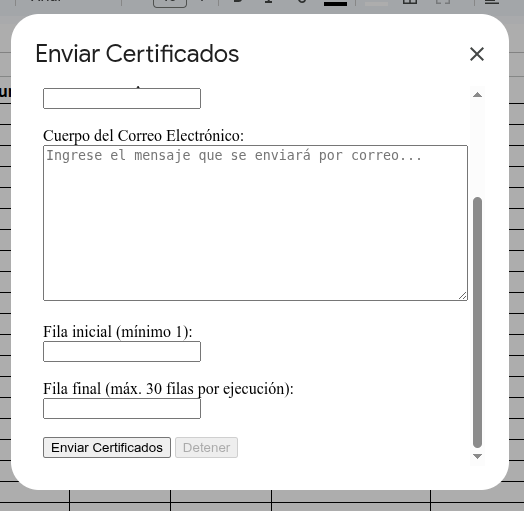

# CertiFlow 🎓📧


**CertiFlow** es una librería de Google Apps Script para la generación y envío masivo de certificados digitales en formato PDF, a partir de una base de datos en Google Sheets y una plantilla de Google Slides. Facilita automatizar todo el proceso, con opciones flexibles para seleccionar filas específicas o rangos, y envío por correo electrónico de manera eficiente.

---

## Características principales ✨

- Generación masiva de certificados en lotes (por defecto 30 certificados por ejecución).  
- Generación basada en filas específicas, separadas por comas sin espacios.  
- Envío masivo de certificados por correo electrónico en lotes.  
- Envío de certificados por correo electrónico para filas específicas y para rangos definidos (mínimo 5, máximo 30 filas).  
- Controla la generación para evitar duplicados, no genera certificados ya existentes.  
- Muestra resumen de progreso en pantalla con mensajes claros durante la ejecución.  
- Interfaz gráfica amigable integrada en un menú personalizado dentro de Google Sheets.  

---

## Requisitos 📝

- Tener un Google Spreadsheet con estos encabezados EXACTOS:
    - ID  
    - primer_nombre  
    - segundo_nombre  
    - primer_apellido  
    - segundo_apellido  
    - prefijo_documento_identidad  
    - documento_identidad  
    - correo_electrónico  
    - Celular  
    - tipo-participante  
    - nombre-evento  
    - cod-evento  
    - cod-certtificado  
    - modalidad  
    - dur-hr-acad  
    - fecha-apertura  
    - fecha-clausura  
    - texto-fecha  
    - ubicacion  
    - URL_Certificado

- La plantilla de Google Slides debe contener los siguientes marcadores encerrado en llaves {}:
    - nombre-participante  
    - di-participante  
    - tipo-participante  
    - nombre-evento  
    - modalidad  
    - horas  
    - texto-fecha  
    - ubicacion  
    - cod-certificado

Los formatos están en la carpeta docs.

# plantilla con los campos incorporados



- La primera ejecución requiere autorización de permisos de Google Apps Script para acceso a Gmail, Drive y Sheets.  
- Puede agregarse una página adicional como contraportada para contenido extra en el certificado (como temario o contenido programático).  
- Los datos de correos y códigos deben estar correctamente ingresados; la librería no verifica duplicados de registros.

---

## Instalación ⚙️

1. Clona o descarga el repositorio en tu máquina local.  
2. Instala [clasp](https://github.com/google/clasp) y configura sus pre-requisitos (Node.js, npm).  
3. Ejecuta `clasp login` para conectar con tu cuenta Google que contiene las hojas de cálculo y Drive a usar.  
4. Usa `clasp push` para subir el proyecto a tu entorno de Google Apps Script.  
5. Desde tu Google Spreadsheet, al abrir el archivo, verás un menú nuevo llamado **Certificados** para ejecutar las funciones.  

*Nota:* Pronto se publicará como librería oficial para importarla directamente sin necesidad de descargar, pero aún está en desarrollo.

---

## Uso 🚀

Al abrir tu Google Spreadsheet, en el menú principal verás una nueva opción:

```none
Certificados
├── Generar certificados
│ ├── Todos
│ └── Por filas
└── Enviar certificados
├── Todos
├── Por filas
└── Por rango de filas
```
# Menú principal en la opción "Certificados"


# Submenú de "Generar Certificados"



# Submenú de "Enviar Certificados"


Cada opción abre una interfaz gráfica sencilla para que puedas ingresar los datos necesarios (URL de spreadsheet, plantilla, carpeta Drive, filas o rangos, mensaje personalizado) y ejecutar la acción deseada.

# Interfaz Gráfica de las opciones de menú

# Generar Certificados


# Vista de ejecución


# Generar Certificados por filas


# Enviar Certificados


# Enviar Certificados por filas


# Enviar Certificados por rango de filas



---

## Configuración avanzada 🛠️

- Puedes modificar el tamaño de lote por defecto (30 certificados) en el archivo `utils/utils.gs`, línea 1:

  ```javascript
  const DEFAULT_BATCH_SIZE = 30;


Se permite ingresar URLs completas para hoja de cálculo, plantilla de Slides o carpeta Drive, la librería extraerá automáticamente los IDs usando expresiones regulares.

---

## Estructura del proyecto 📂

```none
src/
├── libs/
│   ├── cert_sender_all.gs         # Envío masivo de certificados por correo
│   ├── cert_sender_range.gs       # Envío de certificados por rango de filas (5 a 30)
│   ├── cert_sender_rows.gs        # Envío de certificados por filas específicas
│   ├── certgen_all.gs             # Generación masiva de certificados
│   ├── certgen_rows.gs            # Generación por filas específicas
├── utils/
│   └── utils.gs                   # Funciones utilitarias y configuraciones
├── main.gs                        # Kernel principal de la librería
├── menu.gs                        # Manejo del menú y GUI en Sheets
├── modal_cert_all.html           # Modal para generar certificados masivos
├── modal_cert_rows.html          # Modal para generar certificados por filas
├── modal_send_all.html           # Modal para enviar certificados masivos
├── modal_send_range.html         # Modal para enviar certificados por rango
├── modal_send_rows.html          # Modal para enviar certificados por filas específicas
└── README.md
```

Autor 👨‍💻
- Oscar Giovanni Castro Contreras
- Ingeniero en Informática
- 📧 oscargiovanni.castro@gmail.com
- 📱 +58 414 703 9597

Licencia 📜
Este proyecto está bajo licencia MIT. ¡Usa, modifica y comparte libremente...!